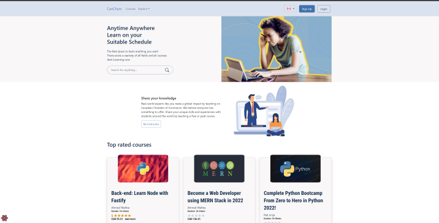

# CanCham

A complete Online Learning System for the CSEN704 Course (Advanced Programming Lab) in GUC (German University in Cairo). An OnlineLearning System is a web application through which individuals can attend pre-recorded courses online. Existing web applications include but are not limited to Coursera, Udemy,
LinkedIn Learning, Great Learning and Udacity.

## Motivation

The project was created as a part for the CSEN704 Course (Advanced Programming Lab) in GUC (German University in Cairo). The goals is to learn fullstack web application development using MERN Stack ([MongoDB](https://www.mongodb.com/), [express](https://expressjs.com/), [React](https://reactjs.org/), [Node.js](https://nodejs.org/en/))

## Build Status

The project is currently under development. The goals for Sprint 1 are done.

## Code Style

- [ESLint](https://eslint.org) is used to statically analyzes the code to quickly find problems. It is run as a part of the commit workflow to ensure code adhere to the rules.

- [Prettier](https://prettier.io/) is used as a part of the commit workflow to style the code according to configured rules to ensure code adhere to style guidelines.

## Tech/Framework used

- [MongoDB](https://www.mongodb.com/) is used as the Database server.
- [express](https://expressjs.com/) is used as the backend webserver. 
- [React](https://reactjs.org/) is used as the frontend framework
- [Node.js](https://nodejs.org/en/) is used as the javascript engine running express webserver and also used in front end development for tooling and building the application.
- [yarn](https://classic.yarnpkg.com/lang/en/) is used as the package manager.
- [vite](https://vitejs.dev/) is used for frontend tooling.
- [Typescript](https://www.typescriptlang.org/) is used as the main development language for both the frontend and the backend.
- [Bootstrap](https://getbootstrap.com/) is used as a CSS library for styling the web pages.
- [Sass](https://sass-lang.com/) is used a CSS preprocessor.

## Screenshots



## Requirements 
https://docs.google.com/spreadsheets/d/1thSj70wa_c92RsPPZQMNa1ugQsBgJ7_skk99WifvcCI/edit?usp=sharing

## Run Locally

- Clone the project

```bash
git clone https://github.com/Advanced-Computer-Lab-2022/Hungry-for-Grades
```
### Start the frontend
- Change to the client directory and run yarn to install packages then yarn dev.
```bash
cd Hungry-for-Grades/client
yarn
yarn dev
```
### Start the backend
- Change to the server directory and run yarn to install packages then yarn dev.
```bash
cd Hungry-for-Grades/server
yarn
yarn dev
```

## Authors

- [Omar Sherif Ali](https://www.github.com/omar-sherif9992)
- [Omar Sherif Elmeteny](https://github.com/omar-elmeteny)
- [Ahmed Wahba](https://github.com/AWahba1)
- [Hussein Yasser](https://github.com/HusseinYasser)
- [Mohamed Shams](https://github.com/Abo4ams)
